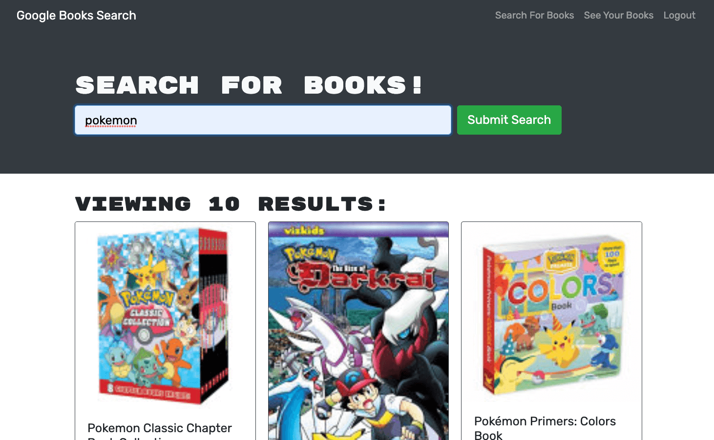
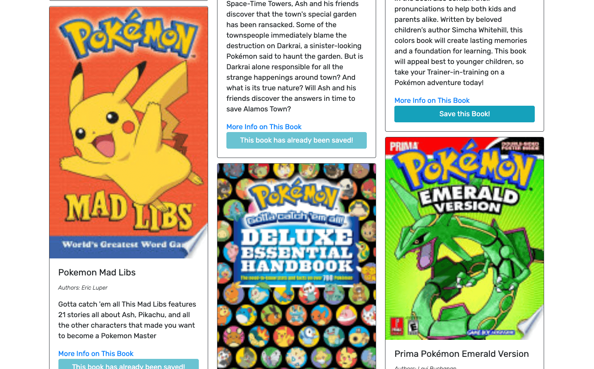
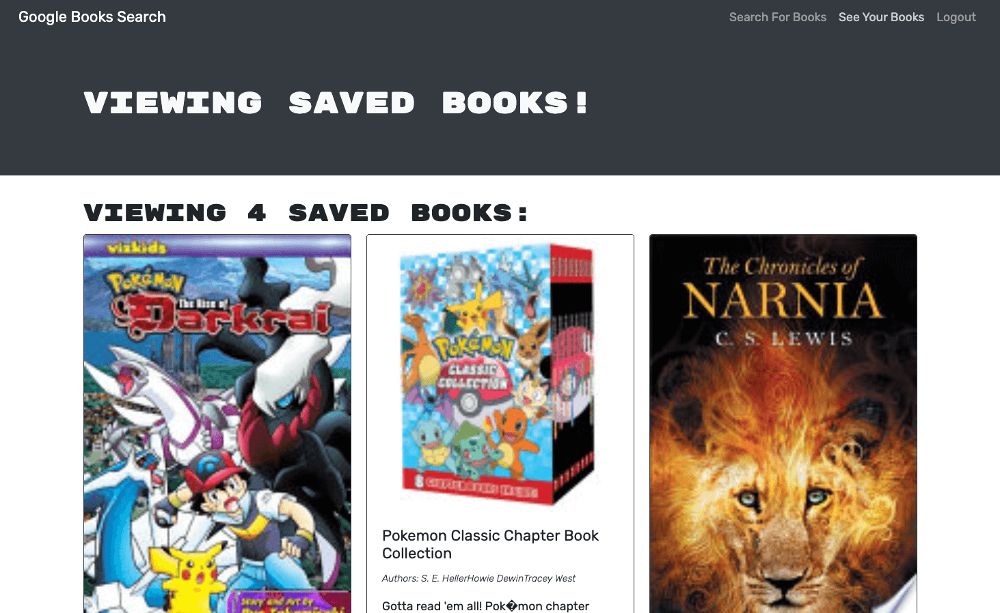

# Book Search Engine

## Description
The purpose of this application is to provide a way for a user to search books from the google books API, retrieve data pertaining to the books they are looking for, and save a list of books with the needed data to visit later. This is a MERN application with GraphQL, utlizing the following technologies:
- MongoDB with Mongoose
- Express.js
- React.js
- Node.js
- JavaScript
- GraphQL (Apollo)

## Table of Contents
* [Installation](#installation)
* [Usage](#usage)
* [Credits](#credits)
* [License](#license)
* [Contributing](#contributing)
* [Tests](#tests)
* [Questions](#questions)

## Installation
If you would like to download and install this repo for adaptation and local use, use this step:

Use the command 'git clone' in your command line with the link of this repo while navigated to your desired directory to copy this repo to your machine, run 'npm install' or 'npm i' in your command line in the root folder of this application to install dependencies. Use the command 'npm run develop' in the root folder to concurrently run the graphql server and the react dev environment. For production deployment, use 'npm run build'. To create your own react app from start using npx, use "npx create-react-app" in your command line. You can also check out [React's documentation here](https://reactjs.org/docs/create-a-new-react-app.html) for more on creating a react app. For more on implementing GraphQL using Apollo, check out [Apollo's documentation here](https://www.apollographql.com/docs/).

## Usage
- Deployed Use:
To use this application, use the deployed link below to search books, signing up or logging in to save books. This application uses the Google Books API for getting book data from the search. Without signup or login, you can search books and display more information on a chosen book. By clicking signup or login and filling out the form, you will be able to save books to your book list. In that saved book list, you go back and view book details or remove them from your list.
- Local Use:
Follow the installation instructions above. If you'd like to customize the data using different endpoints from Google Books API after installing this repo locally, see the data you can get at the [Google Books API documentation](https://developers.google.com/books/docs/v1/using). To test out your graphql queries/mutations and your react front end, run "npm run develop" from the root folder of this application in your command line.

### Deployed link and Screenshots

## Credits
The user guidelines and starter code for this project were given by Trilogy Education as a part of the University of Kansas Full Stack Web Developer Bootcamp. © 2021 Trilogy Education Services, LLC, a 2U, Inc. brand. Confidential and Proprietary. All Rights Reserved. 

The app was a working React application with connected API through mongoose, which I converted the functionality over to GraphQL. All mutations and queries, javascript functions and react hooks to call those queries and mutations, graphQL connection in the server, and some of the conditional rendering is my code.

## License
  
  
### MIT LICENSE

Permission is hereby granted, free of charge, to any person obtaining a copy of this software and associated documentation files (the "Software"), to deal in the Software without restriction, including without limitation the rights to use, copy, modify, merge, publish, distribute, sublicense, and/or sell copies of the Software, and to permit persons to whom the Software is furnished to do so, subject to the following conditions:

The above copyright notice and this permission notice shall be included in all copies or substantial portions of the Software.

THE SOFTWARE IS PROVIDED "AS IS", WITHOUT WARRANTY OF ANY KIND, EXPRESS OR IMPLIED, INCLUDING BUT NOT LIMITED TO THE WARRANTIES OF MERCHANTABILITY, FITNESS FOR A PARTICULAR PURPOSE AND NONINFRINGEMENT. IN NO EVENT SHALL THE AUTHORS OR COPYRIGHT HOLDERS BE LIABLE FOR ANY CLAIM, DAMAGES OR OTHER LIABILITY, WHETHER IN AN ACTION OF CONTRACT, TORT OR OTHERWISE, ARISING FROM, OUT OF OR IN CONNECTION WITH THE SOFTWARE OR THE USE OR OTHER DEALINGS IN THE SOFTWARE.

## Contributing
No contributing guidelines currently

## Tests
No tests at this time

## Questions
You can find my GitHub profile at https://github.com/bgswilde
For any further questions, reach out to me via email at bgswilde@gmail.com.